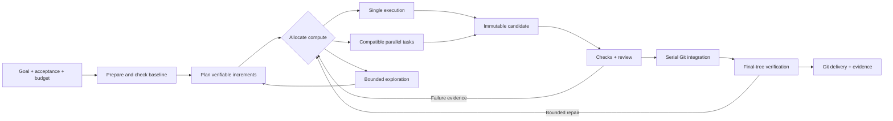

<p align="center">
  
</p>

<p align="center">
  <strong>A terminal workspace for long-horizon agentic software engineering.</strong><br />
  Adaptive compute. Artifact-backed coordination. Evidence-gated delivery.
</p>

<p align="center">
  <a href="LICENSE"></a>
  
  
  
</p>

<p align="center">
  <a href="#quick-start">Quick start</a> · <a href="#connect-your-models">Models & APIs</a> · <a href="docs/CLI.md">Terminal guide</a> · <a href="docs/ARCHITECTURE.md">Architecture</a> · <a href="README.zh-CN.md">简体中文</a>
</p>

## One goal. A persistent engineering workflow.

Give TripleTeam a repository, an engineering goal and an execution budget. It coordinates planning, exploration, implementation and review, preserves progress across attempts, and brings the work together as a Git delivery with a checkable evidence trail.

Built for changes that span **multiple modules, dependent stages and repeated verification**: substantial features, repository refactors, complex fixes and coordinated upgrades.

| Decide where compute goes | Coordinate through artifacts | Finish against evidence |
| --- | --- | --- |
| Choose single execution, compatible parallel work or bounded exploration using dependencies, coupling, runtime feedback and budget. | Bind interface obligations to versioned Git artifacts and named checks. Reverify affected consumers when an implementation evolves. | Check immutable candidates, review changes, serialize integration and verify the final tree against a frozen acceptance contract. |

## Your terminal, with the whole task in view

<p align="center"></p>

*Rendered from the actual TripleTeam interface using sample data. Try it with `tripleteam demo`; no API key or repository is needed.*

- **Start naturally** — open `tripleteam` and type an engineering goal. `/continue` picks up saved work.
- **See what matters** — current goal, active tasks and decisions that need your input. `/tasks` expands details.
- **Configure in place** — `/models`, `/model` and `/settings` expose role models, budgets, parallelism and checks.
- **Discover commands** — grouped `/help`, `Tab` completion, input history and `PgUp / PgDn` for details.
- **Inspect delivery** — `/delivery` shows the Git artifact and evidence; `/events` opens the detailed timeline.
- **Automation** — `--json`, automatic JSON when piped, `--plain` and `NO_COLOR`.

TripleTeam has its own layout, navigation and product workflow. Pi runs agents in the background through public RPC; users do not enter Pi's chat interface.

## Quick start

**Requirements:** Node.js **22.19+**, Git, `rg` (ripgrep), `fd`/`fdfind`, and access to a model provider. The search binaries can also be available in Pi's tool cache. Linux, macOS or WSL2 are the recommended command-line environments. Docker is used for isolated behavioral verification.

```bash
git clone https://github.com/npm-DreaMaX/TripleTeam.git
cd TripleTeam
npm install --ignore-scripts
npm run build
npm link --ignore-scripts

tripleteam doctor
tripleteam demo
```

Without a global installation, use `node /path/to/TripleTeam/dist/cli.js` in place of `tripleteam`.

`doctor` exercises the actual Pi search tools without inference or downloads. Worker startup repeats the checks for its selected tools so a missing executable is detected before spending model tokens.

### Connect your models

Each role can use its own **provider, model and reasoning level**. Planning, exploration, implementation, review and independent verification can use different APIs. Omitted role settings inherit the global selection.

**Built-in providers:** export your provider's API key and inspect locally registered model IDs:

```bash
export ANTHROPIC_API_KEY='your-key'
# Or configure the provider you use:
export OPENAI_API_KEY='your-key'

tripleteam models anthropic --plain
tripleteam models openai --plain
```

Put `.tripleteam.json` in the **target repository**. Replace the model placeholders with IDs returned by `tripleteam models`:

```json
{
  "execution": {
    "provider": "openai",
    "model": "YOUR_CODING_MODEL_ID",
    "reasoning": "medium",
    "policy": "ADAPTIVE",
    "maxParallelism": 4,
    "tokenLimit": 1000000,
    "roles": {
      "planner": {
        "provider": "anthropic",
        "model": "YOUR_PLANNING_MODEL_ID",
        "reasoning": "high"
      },
      "explorer": {
        "model": "YOUR_FAST_MODEL_ID",
        "reasoning": "low"
      },
      "reviewer": {
        "provider": "anthropic",
        "model": "YOUR_REVIEW_MODEL_ID",
        "reasoning": "high"
      },
      "verifier": {
        "model": "YOUR_VERIFICATION_MODEL_ID",
        "reasoning": "high"
      }
    }
  }
}
```

The implementer inherits the global model in this example. Parallel implementers share that role's configuration. Every role contributes to the same run budget.

**Custom API endpoints:** register OpenAI-compatible, Anthropic or Google API providers in `~/.pi/agent/models.json`. Each provider may use a separate URL and credential:

```json
{
  "providers": {
    "my-coding-api": {
      "baseUrl": "https://YOUR_API_HOST/v1",
      "api": "openai-completions",
      "apiKey": "$MY_CODING_API_KEY",
      "authHeader": true,
      "models": [{ "id": "YOUR_MODEL_ID" }]
    }
  }
}
```

```bash
export MY_CODING_API_KEY='your-key'
tripleteam models my-coding-api --plain
```

Then select `"provider": "my-coding-api"` and the matching model ID globally or for a role. Use `$ENV_VAR` in the registry for environment references; API keys belong in your environment or user configuration.

Full setup, protocol selection, pricing and copyable multi-provider templates: **[Model & API configuration](docs/CONFIGURATION.md)**.

For DeepSeek, a ready-to-edit [provider registry](examples/models.deepseek.json) includes `deepseek-flash`, reasoning compatibility and a price table. Set `TRIPLETEAM_DEEPSEEK_API_KEY` in your environment, merge the example into your Pi registry, then select `"provider": "deepseek", "model": "deepseek-flash"`.

### Run an engineering task

From your target Git repository:

```bash
tripleteam
```

Inside the workspace, after configuring your provider:

```text
/model all deepseek/deepseek-flash high
/settings execution.maxParallelism 2
/settings execution.costLimitUsd 5
Add a resumable export workflow with API, SDK support and tests
```

Settings apply to new runs. Existing runs retain their frozen models, budgets and acceptance checks. For a one-shot invocation or script, use `tripleteam run "your engineering goal"`.

In another terminal, follow the same work:

```bash
tripleteam dashboard
tripleteam status --json
```

Inspect or continue it later:

```bash
tripleteam continue
tripleteam decisions
tripleteam result
```

Successful delivery includes `refs/heads/tripleteam-deliveries/<run-id>` and an evidence manifest. Your checkout stays in place; review the delivery with ordinary Git.

## How the work converges

Inspect `/why` for the actual coordination decision, live writers, verification allocation and remaining final checks. Check scopes define independently verifiable increments; atomic obligations keep coupled changes together. Frozen preparation runs on clean worktrees, and baseline failures inform planning before model execution. Repository observations can be reused only while their question, profile, context and Git read dependencies remain valid.



## A real repository demonstration

```bash
tripleteam demo create /tmp/atlas-demo
cd /tmp/atlas-demo
tripleteam
```

Ask it to implement the asynchronous report export workflow in `SPEC.md`, preserving existing behavior and passing final acceptance. The starter includes contracts, a job module, an HTTP API, an SDK and public acceptance tests. Supply an immutable Python Docker image as the second argument to `demo create` for protected behavioral checks. The scheduler chooses single or parallel work from the actual task and budget.

[Acceptance and demonstration](docs/ACCEPTANCE.md) · [Benchmark guide](docs/BENCHMARK_GUIDE.zh-CN.md)

Use **FeatureBench** for feature delivery and cost, and **SWE-Milestone** for continuous evolution. Frozen experiment manifests, complete usage accounting and paired analysis make delivery quality, cost and latency measurable.

## Designed for long-running work

- **Persistent task state.** Tasks outlive individual attempts, processes and model sessions.
- **Isolated writers.** Each writer attempt works in its own Git worktree; epoch checks fence stale execution.
- **Executable coordination.** `provides`, `requires` and assumptions carry artifact and check obligations.
- **Independent verification before implementation.** Derive source-cited behavior obligations, execute counterexamples, then critique surviving probes in a fresh context. Verify each increment at its own stage and repeat every frozen obligation on the final tree.
- **Failure-aware continuation.** Preserve useful candidates; use retry, diagnosis, replanning or revalidation according to failure evidence.
- **Explicit budgets.** Planning, workers, review, retries and recovery share recorded token, cost and execution limits.
- **Human on exception.** Product choices and authority changes become durable decision requests. Technical investigation stays in the execution workflow.
- **Recoverable delivery.** SQLite authority, an operation journal and Git compare-and-swap connect process recovery to the final artifact.

## Configure acceptance

TripleTeam discovers declared npm, pytest, Cargo and Go checks. Projects can provide explicit candidate, integration and final checks in `.tripleteam.json`. Independent probes supplement those checks; their coverage and computation limits are configurable through `assurance`.

Final reports distinguish **`VERIFIED_DELIVERY`**, **`STRUCTURAL_HANDOFF`**, **`BLOCKED`** and **`CANCELLED`**. Behavioral delivery uses protected acceptance checks in a pinned, read-only container; structural and build evidence remain clearly labeled. See [verification configuration](docs/VERIFICATION.md).

## CLI at a glance

| Command | Purpose |
| --- | --- |
| `tripleteam` / `tripleteam shell [repo]` | Open the goal input and command workspace |
| `tripleteam demo` | Explore the UI with sample data |
| `tripleteam demo create <new-directory> [image]` | Create a real cross-module engineering task |
| `tripleteam run "goal" [repo]` | Plan and execute an objective |
| `tripleteam continue [repo] [run-id]` | Reconcile and continue existing work |
| `tripleteam status --watch` | Follow the live dashboard |
| `tripleteam why [repo] [run-id]` | Inspect compute decisions and remaining delivery gates |
| `tripleteam profiles [repo]` | Inspect effective model selections for every role |
| `tripleteam models [filter]` | Inspect the local provider/model registry |
| `tripleteam model role provider/model [reasoning]` | Select a model for a role or `all` roles |
| `tripleteam settings [key [value]]` | Browse and update validated next-run settings |
| `tripleteam decisions [repo]` | Inspect pending human decisions |
| `tripleteam result [repo]` | Show delivery ref and evidence manifest |
| `tripleteam doctor` | Check the local installation |

Run `tripleteam help` for messages, proposals, retry, cancellation and daemon controls. [Complete terminal guide →](docs/CLI.md)

## Explore the project

| Guide | Contents |
| --- | --- |
| [Models & APIs](docs/CONFIGURATION.md) | Per-role models, separate API keys, custom endpoints and budgets |
| [Terminal guide](docs/CLI.md) | Navigation, run lifecycle, daemon use and automation |
| [Architecture](docs/ARCHITECTURE.md) | Task / Attempt / Execution, contracts, integration and recovery |
| [Verification](docs/VERIFICATION.md) | Check configuration and evidence levels |
| [Independent probes](docs/INDEPENDENT_VERIFICATION.md) | Specification sources, executable counterexamples, critique and frozen check batches |
| [Evaluation adapters](docs/BENCHMARK_ADAPTERS.md) | FeatureBench and SWE-Milestone workflows |
| [Comparison protocol](docs/BASELINE_COMPARISON.md) | Product baselines and controlled policy ablations |
| [Upstream inventory](UPSTREAM.md) | Fixed Pi snapshot, public APIs and third-party attribution |

## Development

```bash
npm install --ignore-scripts
npm run check
npm test
npm run build
```

The vendored Pi snapshot owns model execution, tools, sessions and compaction. TripleTeam owns coordination, authority, artifacts, verification and delivery. Runtime dependencies are pinned; see [AGENTS.md](AGENTS.md) before changing these boundaries.

Contributions are welcome: include the engineering scenario, the expected behavior and a reproducible check. For bugs, include your Node/Git versions, configuration with secrets removed, and relevant command output.

**[MIT licensed](LICENSE).** Third-party components retain their own notices in [THIRD_PARTY_NOTICES.md](THIRD_PARTY_NOTICES.md).
