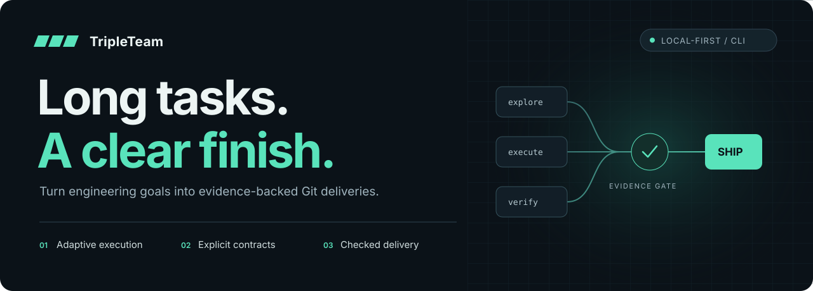
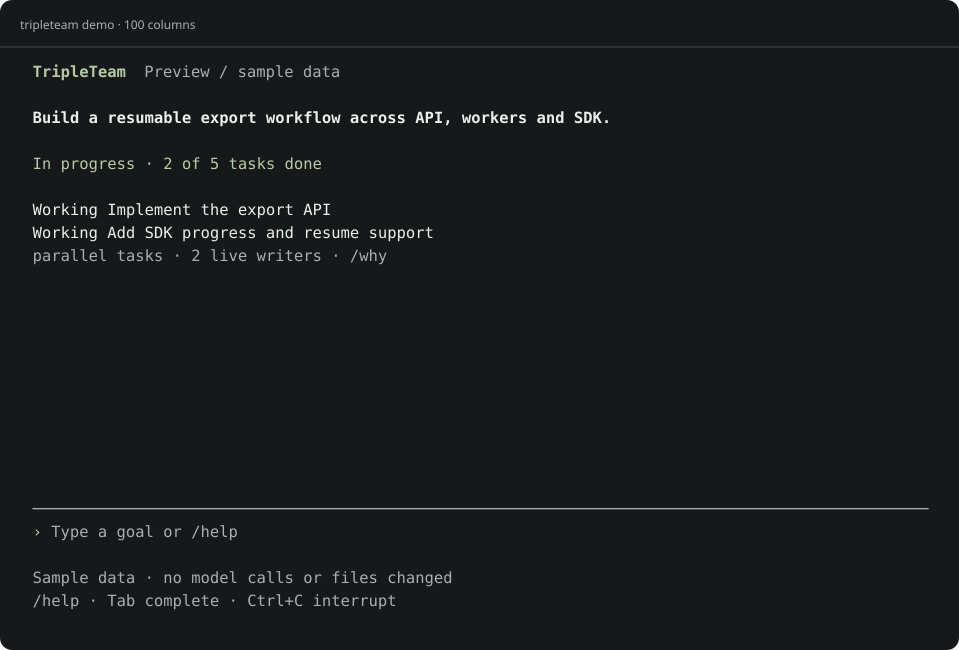

<p align="center"></p>

<p align="center"><strong>面向长程软件工程任务的自适应执行与可信交付系统</strong><br />自主规划 · 多模型协作 · 产物驱动验收</p>

<p align="center"><a href="README.md">English</a> · <a href="#安装">安装</a> · <a href="#给主规划与子任务配置不同模型">模型与 API</a> · <a href="docs/CLI.md">终端指南</a> · <a href="docs/ARCHITECTURE.md">架构</a></p>

## 一个目标，贯穿整个工程过程

交给 TripleTeam 一个仓库、一个工程目标和计算预算。系统按任务依赖与运行证据组织规划、探索、实现和审查，跨多次执行保留有效进展，最终形成普通 Git 可检查的代码交付与证据记录。

适合跨模块功能开发、复杂缺陷修复、仓库重构与协调升级：这些任务往往有多阶段依赖，需要反复检查、调整实现路径并整合成果。

| 自适应计算分配 | 以产物兑现协作 | 以证据确认交付 |
| --- | --- | --- |
| 根据依赖、耦合、失败反馈和预算选择单执行、兼容并行或有界探索。 | 接口承诺绑定版本化代码与指定检查；接口变化触发受影响任务复验。 | 不可变候选经过检查、审查、串行集成和最终树验证，形成交付报告。 |

## 独立终端工作台



上图由实际界面组件渲染，使用明确标注的示例数据。运行 `tripleteam demo` 即可体验，不需要 API Key。

- **直接开始**：运行 `tripleteam`，输入工程目标；`/continue` 恢复已有工作。
- **清楚的进展**：默认展示当前目标、正在处理的任务和需要你做的决定；`/tasks` 展开详情。
- **知道为什么**：`/why` 展示调度理由、真实 writer 数量、计算分配与剩余验收检查。
- **随时配置**：`/models` 查看角色，`/model` 选择模型，`/settings` 调整预算、并行度和验证规则。
- **命令可发现**：`/help` 分组说明，`Tab` 补全，方向键回看输入，`PgUp / PgDn` 滚动详情。
- **独立交付**：`/delivery` 获取最终 Git ref 与证据；`/events` 按需查看事件。
- **脚本友好**：`--json`、管道自动 JSON、`--plain`、`NO_COLOR`。

这是 TripleTeam 自己的界面与操作流程。Pi 通过 RPC 在后台执行 Agent，无需进入 Pi 的聊天界面。

## 安装

需要 Node.js **22.19+**、Git、`rg`（ripgrep）和 `fd`／`fdfind`；搜索工具也可以位于 Pi 的工具缓存中。建议使用 Linux、macOS 或 WSL2；隔离行为验收使用 Docker。

```bash
git clone https://github.com/npm-DreaMaX/TripleTeam.git
cd TripleTeam
npm install --ignore-scripts
npm run build
npm link --ignore-scripts

tripleteam doctor
tripleteam demo
```

不方便全局安装时，用 `node /path/to/TripleTeam/dist/cli.js` 替代 `tripleteam`。

`doctor` 会离线调用实际的 Pi 搜索工具，不调用模型或自动下载。每个 worker 启动前也会检查自己需要的搜索工具，避免缺少可执行文件时仍持续消耗模型预算。

## 给主规划与子任务配置不同模型

每个角色都支持独立设置 **provider、model、reasoning**。规划、实现、探索、审查与独立验证可以分别使用不同 API。未指定的角色继承全局配置。

### 方式一：内置供应商

设置需要使用的供应商密钥，并查看可选模型 ID：

```bash
export ANTHROPIC_API_KEY='你的密钥'
export OPENAI_API_KEY='你的密钥'
tripleteam models anthropic --plain
tripleteam models openai --plain
```

在**待修改的目标仓库**中创建 `.tripleteam.json`，将占位模型名换成实际 ID：

```json
{
  "execution": {
    "provider": "openai",
    "model": "YOUR_CODING_MODEL_ID",
    "reasoning": "medium",
    "policy": "ADAPTIVE",
    "maxParallelism": 4,
    "tokenLimit": 1000000,
    "roles": {
      "planner": { "provider": "anthropic", "model": "YOUR_PLANNING_MODEL_ID", "reasoning": "high" },
      "explorer": { "model": "YOUR_FAST_MODEL_ID", "reasoning": "low" },
      "implementer": { "provider": "openai", "model": "YOUR_CODING_MODEL_ID", "reasoning": "medium" },
      "reviewer": { "provider": "anthropic", "model": "YOUR_REVIEW_MODEL_ID", "reasoning": "high" },
      "verifier": { "model": "YOUR_VERIFICATION_MODEL_ID", "reasoning": "high" }
    }
  }
}
```

| 角色 | 职责 |
| --- | --- |
| `planner` | 主规划与失败后的重新规划 |
| `explorer` | 只读调查与竞争假设探索 |
| `implementer` | 独立 worktree 中的代码实现、重试和恢复 |
| `reviewer` | 独立候选审查、检查设计的独立批判 |
| `verifier` | 在实现之前依据公开规格设计行为义务与可执行检查 |

同角色的并行实例使用该角色配置；全部角色共享总预算。调度、权限判断和最终接受由确定性控制面负责。

### 方式二：自定义 API 地址／代理／本地模型

在 `~/.pi/agent/models.json` 注册供应商：

```json
{
  "providers": {
    "my-api": {
      "baseUrl": "https://YOUR_API_HOST/v1",
      "api": "openai-completions",
      "apiKey": "$MY_API_KEY",
      "authHeader": true,
      "models": [{ "id": "YOUR_MODEL_ID" }]
    }
  }
}
```

```bash
export MY_API_KEY='你的密钥'
tripleteam models my-api --plain
```

然后在全局或角色配置中设置 `"provider": "my-api"` 与对应模型 ID。不同 provider 可以配置不同 URL、协议和 Key。环境变量引用必须写成 `$MY_API_KEY`；不需要把真实密钥写进仓库。

完整说明：[模型与 API 配置](docs/CONFIGURATION.md)。可复制模板：[多模型项目配置](examples/tripleteam.mixed-models.json)、[多 API 供应商配置](examples/models.example.json)。

DeepSeek 可使用[现成的供应商模板](examples/models.deepseek.json)：在环境中设置 `TRIPLETEAM_DEEPSEEK_API_KEY`，将模板合并到 Pi registry，再设置 `"provider": "deepseek", "model": "deepseek-flash"`。模板包含 reasoning 兼容配置与可更新的费用表。

## 开始使用

```bash
cd /path/to/your/git/repository
tripleteam
```

在界面中输入：

```text
/model all deepseek/deepseek-flash high
/settings execution.maxParallelism 2
/settings execution.costLimitUsd 5
实现可恢复的导出任务，包含 API、SDK 支持与测试
```

模型需要先完成上述 API 配置。设置只对新任务运行生效，已有运行继续使用冻结的模型、预算与验收规则。脚本或单次执行也可直接使用 `tripleteam run "你的工程目标"`。

另开终端查看进展：

```bash
tripleteam dashboard
tripleteam status --json
```

后续继续或获取交付：

```bash
tripleteam continue
tripleteam decisions
tripleteam result
```

成功交付包含 `refs/heads/tripleteam-deliveries/<run-id>` 和证据清单，使用普通 Git 即可审查。当前 checkout 保持在原位置。

## 长程任务需要的执行能力

- **持久进展**：Task 与 Attempt、Execution 分离，进程结束不丢失工程事实。
- **隔离写入**：writer 使用独立 worktree，epoch fencing 拒绝旧执行提交。
- **接口合同**：声明绑定 artifact 与检查，消费者记录实际使用的版本和证据。
- **先明确行为，再检查实现**：实现前引用公开规格生成检查，先用同一组断言拒绝可执行的错误实现，再由独立上下文审查；按阶段验证当前增量，最终代码树重新执行全部冻结义务。
- **差异化失败处理**：保留候选，根据失败执行重试、诊断、重规划或复验。
- **共享预算**：规划、探索、实现、审查与恢复统一记录和限制计算用量。
- **可验证的任务粒度**：根据检查作用范围划分阶段；不可分割的验收单元自动合并，最终验收保持冻结。
- **先验证环境**：在干净工作树诊断基线，执行固定的依赖准备，避免缺少环境时继续消耗模型计算。
- **减少重复探索**：相同问题仅在模型配置、上下文和所读 Git 文件/目录均匹配时复用观察，并保留来源。
- **异常找人**：产品选择和权限变化形成明确的 DecisionRequest。
- **可信集成**：Git CAS 串行发布、最终树验证与终态交付报告。

验收结果区分 `VERIFIED_DELIVERY`、`STRUCTURAL_HANDOFF`、`BLOCKED` 和 `CANCELLED`，按照实际证据强度报告。配置入口见[验证指南](docs/VERIFICATION.md)。

自动发现 npm、pytest、Cargo、Go 的已声明检查；`assurance` 控制补充验证的预算和强度。新增的模型检查保留规格来源、独立审查和重复执行记录，详见[独立验证机制](docs/INDEPENDENT_VERIFICATION.md)。

## 演示与验收

```bash
tripleteam demo create /tmp/atlas-demo
cd /tmp/atlas-demo
tripleteam
```

输入“按照 SPEC.md 完成异步报表导出，保留同步接口并通过最终验收”。这是一个真正的跨模块改造：共享协议、任务处理、HTTP API 与 SDK。系统按依赖与预算决定单 Agent 或并行执行。提供不可变 Python Docker image 作为 `demo create` 的第二个参数，可以使用隔离行为验收。

[完整演示与验收步骤](docs/ACCEPTANCE.md) · [Benchmark 选择与执行](docs/BENCHMARK_GUIDE.zh-CN.md)

评测主线为 **FeatureBench：功能交付与成本**，补充 **SWE-Milestone：连续演进**。CooperBench 用于协作机制分析。内置冻结实验、完整用量账本和配对分析，可系统比较交付质量、费用与延迟。

## 文档与开发

[终端命令](docs/CLI.md) · [架构说明](docs/ARCHITECTURE.md) · [评测适配](docs/BENCHMARK_ADAPTERS.md) · [对照协议](docs/BASELINE_COMPARISON.md) · [上游复用与许可证](UPSTREAM.md)

```bash
npm run check
npm test
npm run build
```

项目以 MIT 协议开源，第三方依赖保留其原始许可证。欢迎携带具体工程场景、复现步骤与验证结果提交贡献。
