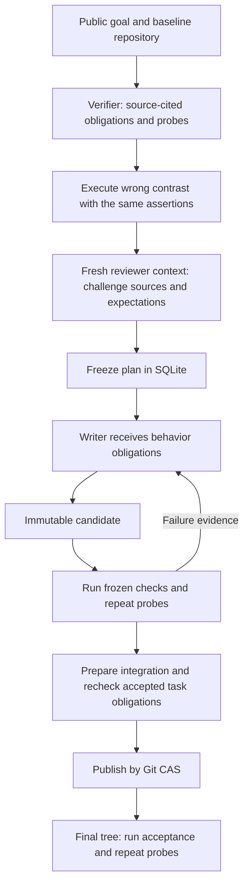

# Independent specification and executable probes

[README](../README.md) · [Configuration](CONFIGURATION.md) · [Evidence levels](VERIFICATION.md)

An implementation can pass its author's tests while sharing the same misunderstanding of a requirement. TripleTeam spends a bounded part of the run budget on a separate specification and verification process before the writer starts. The resulting probes supplement the operator's acceptance contract.

## Execution sequence



1. **Specification design.** A read-only Pi session using the `verifier` role derives behavior obligations. Every obligation quotes an exact substring of the public goal, task constraints or a tracked baseline file. File references record Git blob identity. The service checks that quotes actually occur in those sources.
2. **Executable contrast.** Each probe has real `setup`, shared `assertions` and a `contrastSetup` representing a plausible wrong implementation or result. The contrast must fail in the assertion phase. An import failure, setup exception or forced exit does not demonstrate discrimination. The real setup must exercise repository code. This validates sensitivity to the declared contrast, not complete mutation coverage. Failed controls return to design before purchasing a critique call.
3. **Independent critique.** A separate Pi session using `reviewer` checks the proposed expectations, task scope, coverage and plausible errors against the same public inputs. It does not receive a writer explanation. Passing executable controls does not bypass this review. Rejected designs are revised within `maxDesignAttempts`; attempts and feedback persist across restarts.
4. **Frozen plan.** The accepted definition, sources, design/critique attempts and control checks are immutable for that Task revision. The writer receives the obligations. Ordinary failure evidence contains the relevant output needed to repair the implementation.
5. **Repeated evaluation.** Each probe runs in fresh check worktrees, twice by default. Different outcomes make the batch an error. Candidate, prepared integration and final run each need their own results; identical source trees do not make those subjects interchangeable.

The two model contexts may use the same model or different providers. Context separation reduces direct answer leakage; it does not make their errors statistically independent or turn generated expectations into an authoritative oracle.

## Configuration

Set this in the target repository's `.tripleteam.json` before starting a run:

```json
{
  "assurance": {
    "mode": "adaptive",
    "maxObligations": 8,
    "maxProbes": 3,
    "maxDesignAttempts": 2,
    "maxDesignTokens": 300000,
    "maxDesignToolCalls": 40,
    "maxDesignMs": 180000,
    "repetitions": 2,
    "probeTimeoutMs": 30000
  }
}
```

| Setting | Meaning |
| --- | --- |
| `adaptive` | Require probes for medium/high-risk tasks and tasks without protected behavioral integration checks; choose probe count using risk, uncertainty and observed failed probes |
| `required` | Require independent probes for every task, up to the configured cap |
| `off` | Disable this supplementary mechanism explicitly, useful for an ablation |
| `maxObligations` | 1–24 source-cited behavior obligations, default 8 |
| `maxProbes` | 1–8 programs covering those obligations, default 3 |
| `maxDesignAttempts` | 1–4 bounded design attempts per Task revision, default 2 |
| `maxDesignTokens` | 1–3000000 total observed tokens per design or critique call, default 300000 |
| `maxDesignToolCalls` | 1–400 tool calls per design or critique call, default 40 |
| `maxDesignMs` | 1–1800000 milliseconds per design or critique call, default 180000 |
| `repetitions` | 1–3 executions of every probe on every subject, default 2 |
| `probeTimeoutMs` | 1–300000 milliseconds per execution, default 30000 |

Optional `assurance.isolation` accepts the same pinned Docker image, memory and CPU settings as ordinary checks. The image must contain the selected Python/Node interpreter and test dependencies. Native execution monitors source integrity and removes common credential variables from the child environment; it is not an OS sandbox. Configure Docker or an externally isolated task container where that boundary is needed.

Probes may use temporary directories and mocks to exercise CLI behavior without modifying tracked source or performing real external operations. Proposed definitions and exact rejection reasons persist before correction. A quote mismatch identifies the obligation, source and rejected text; the next design receives the previous definition for local correction. Exhausted design attempts block the task directly, without repeatedly opening implementation attempts. Stage allocation uses Pi's public steer/abort operations and preserves unknown interrupted usage.

Source schema errors identify the obligation/source index, received keys and required fields. `FILE` sources must use a repository-relative `path`; unknown field names are not silently converted. A JSON syntax failure saves bounded original output, its byte length and any truncation flag alongside the error. Correction and restart retain the last complete definition, including when an older rejection stored `definition: null`.

Existing runs without a frozen `assurancePolicy` retain their original behavior. Starting a new run freezes the current configuration. Changing a project file cannot remove obligations from an existing run.

## Authority and recovery

SQLite migration 9 stores `assurance_plans` and `assurance_evaluations`. Every evaluation creates a durable `STARTED` batch before executing checks. Acceptance requires the latest batch to pass and every required repeat to match all of:

- Task revision and frozen definition hash;
- exact Git tree, subject kind and subject ID;
- probe name, command and check version;
- the same completed evaluation batch.

A crash after one successful repeat cannot combine it with results from an earlier batch. Kernel gates enforce the rule when making a candidate eligible, before integration publication, when accepting a task and when completing a run. Reconciler uses the prepared integration tree when recovering a Git operation. Completed plans can be reused after a crash; their model design calls are not automatically purchased again.

## Evidence and compute accounting

New runs freeze `verificationPolicyVersion: 1`. With `execution.enableComputeAllocation`, optional independent design is chosen once per task revision by an explicit value-of-information heuristic: estimated avoided repair versus design/critique cost, retaining estimated resources for all remaining writers, mandatory reviews and final checks. Existing protected behavior checks can make extra design redundant. `required` mode and HIGH risk still require independent design; a frozen plan cannot be waived by a later budget shortage. Legacy runs retain their original policy. Set the flag false for a mechanism ablation.

`VERIFICATION_ALLOCATION` records the inputs, estimates and reason. These are uncalibrated estimates, not a learned value function or guaranteed cost savings. The controller cannot infer that passing checks fully cover a goal.

A malformed or truncated critique permits one same-session format correction, charged to the remainder of that critique's original time, tool and token allocation. The previously validated test design and executable controls remain fixed. A valid negative verdict still rejects the design; invalid replies cannot approve it. `ASSURANCE_CRITIQUE_FORMAT_REPAIR` records the stop reason and bounded raw response.

### Verification stages

A probe can declare `stage: "TASK"` or `stage: "FINAL"`. TASK probes must be implementable within the increment and its available dependencies; FINAL probes may exercise downstream public entrypoints after the full graph has integrated. At least one TASK probe is required. Every probe still needs a source citation, an executable discriminating control and independent critique before its definition freezes. Candidate and integration checks execute TASK probes; final verification executes **all** probes on the exact final tree. The kernel independently enforces the same selection and batch identities. An omitted stage preserves the original behavior of checking at every gate, including historical frozen plans.

The designer and critic receive the current scope, coordination contract, frozen increment checks and other task scopes. They select a bounded set of precise supplemental obligations; a shared-interface task must not fail merely because a downstream HTTP route has not been implemented yet. Unsupported internal API names remain invalid expectations.

Generated probes always produce `BUILD` evidence, including when executed in Docker. They can reject a candidate; they cannot independently upgrade it to `VERIFIED_DELIVERY`. Protected operator-supplied behavioral/external acceptance checks remain the basis for that delivery class. Unresolved assumptions remain explicit in the plan.

Model usage appears under `SPECIFICATION_DESIGN` and `PROBE_CRITIQUE`; check usage distinguishes controls and actual probes. They share the global execution, token, cost and deadline budgets with implementation and review. Control actions record allocated probe count, observed discoveries and the policy's inputs. The terminal manifest includes the plans and check references.

The adaptive scheduler estimates writer duration from `IMPLEMENT`/`IMPLEMENT_RESUME` usage grouped by writer Attempt. Auxiliary model work and verification have separate costs. Reliability uses completed writer outcomes with a Beta(2,2) prior, capped transfer from other tasks and a conservative score. Repeated diagnosis records do not become independent failures. These estimates and the value-of-investigation coefficients remain uncalibrated heuristics; benchmark ablations are required to establish benefit.

Initial planning has a separate bounded allocation inside the shared run budget. Invalid or over-budget decomposition can fall back to one whole-goal Task while preserving scope, checks and review. This protects implementation and verification compute from unbounded reconnaissance; global exhaustion and authority decisions still block. The public Pi search tools are exercised offline before each worker starts, so missing search binaries fail before inference.

A public Pi `tool_call` hook restricts the target of `grep` and `find` to the current worktree, including explicit symlink targets. This prevents accidental whole-filesystem searches. It does not provide an OS sandbox or restrict every operation available through `read` or `bash`.

## Relevant tests

`assurance.test.ts` exercises real Git and check programs, invalid sources and contrasts, unstable results and stale batches. `assurance-execution.test.ts` executes the complete control path with deterministic Pi responses, including a wrong writer followed by a corrected candidate, final acceptance and interrupted integration recovery. `config-assurance.test.ts` checks configuration, language detection and credential environment filtering. Real API evidence is recorded separately under [validation](validation/).
